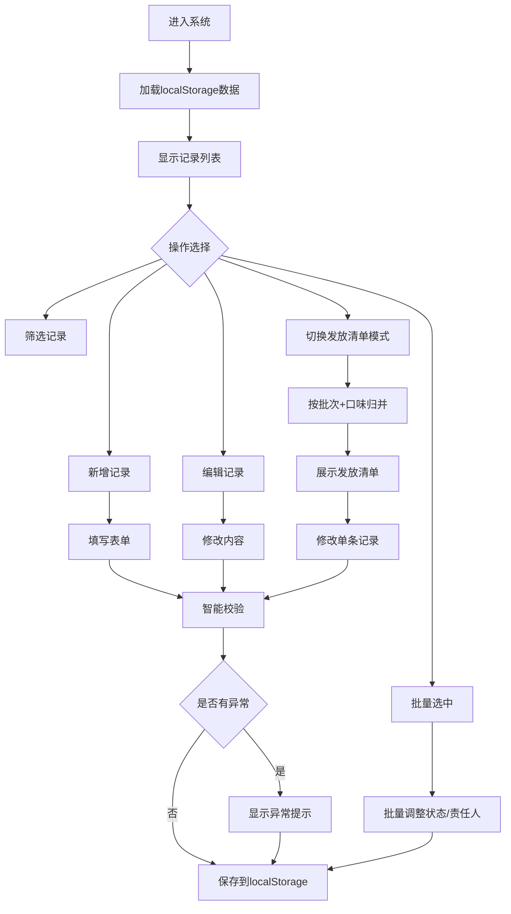

## 1. 产品概述

本系统是一个纯前端的活动零食包管理应用，用于整理零食包分装清单和复核记录，数据完全存储在浏览器localStorage中，无需后端支持。主要面向活动组织者、分装志愿者和复核人员，解决零食包从分装到发放全流程的跟踪和管理问题。

## 2. 核心功能

### 2.1 用户角色
本系统为单用户本地应用，无需角色区分。

### 2.2 功能模块
1. **记录管理页面**：记录列表展示、新增/编辑/删除记录、批量操作
2. **筛选与搜索**：多维度筛选、条件组合
3. **智能校验**：自动识别异常数据并预警
4. **发放清单模式**：按批次和口味归并展示

### 2.3 页面详情

| 页面名称 | 模块名称 | 功能描述 |
|----------|----------|----------|
| 主页面 | 顶部导航栏 | 模式切换（列表模式/发放清单模式）、批量操作按钮、新增记录按钮 |
| 主页面 | 筛选区域 | 口味组合筛选、责任人筛选、目标批次筛选、状态筛选 |
| 主页面 | 记录列表 | 展示所有零食包记录，支持多选、行内编辑 |
| 主页面 | 新增/编辑弹窗 | 填写零食包编号、口味组合、份数、目标批次、责任人、过敏提示、复核备注、状态 |
| 主页面 | 预警提示区 | 显示系统自动识别的异常情况 |
| 主页面 | 发放清单视图 | 按目标批次和口味组合归并展示 |

## 3. 核心流程

## 4. 用户界面设计

### 4.1 设计风格
- **主色调**：温暖的橙红色系（#FF6B35），配合食品行业的活力感
- **辅助色**：清新的薄荷绿（#2EC4B6）代表安全可发放，琥珀黄（#FFB703）代表待复核，浅灰蓝（#8ECAE6）代表待分装，珊瑚红（#E63946）代表暂缓
- **按钮风格**：圆角矩形，轻微阴影，hover时有缩放和颜色加深效果
- **字体**：标题使用'Noto Sans SC'，正文使用系统无衬线字体
- **布局风格**：卡片式布局，清晰的区域分隔，充足的留白
- **图标**：使用语义化emoji增强辨识度，如🍊代表口味、👤代表责任人、📦代表批次、✅代表状态

### 4.2 页面设计概述

| 页面名称 | 模块名称 | UI元素 |
|----------|----------|--------|
| 主页面 | 顶部导航栏 | 品牌标识、模式切换开关、操作按钮组 |
| 主页面 | 筛选区域 | 下拉选择器、标签式筛选、联动筛选 |
| 主页面 | 预警区 | 警示卡片、异常计数、点击跳转定位 |
| 主页面 | 记录列表 | 表格视图、复选框列、状态标签、行操作按钮 |
| 主页面 | 弹窗表单 | 分组字段、实时校验提示、保存/取消按钮 |
| 主页面 | 发放清单 | 分组标题、折叠/展开、组内记录列表 |

### 4.3 响应式
- 采用桌面优先设计，适配1280px以上屏幕
- 平板和移动端自适应布局，筛选区转为可折叠面板
- 表格在小屏幕转为卡片式列表展示
- 触摸优化：增大按钮点击区域，支持滑动操作

### 4.4 动画与交互
- 页面加载时列表项按序淡入
- 状态变更时标签颜色平滑过渡
- 异常预警出现时轻微抖动提示
- 批量选择时顶部操作栏滑入
- 弹窗出现时背景模糊+缩放动画
