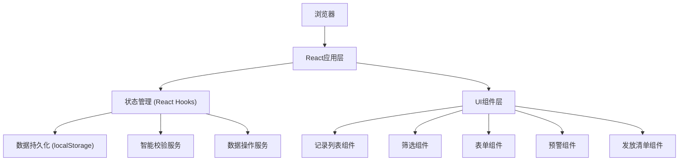
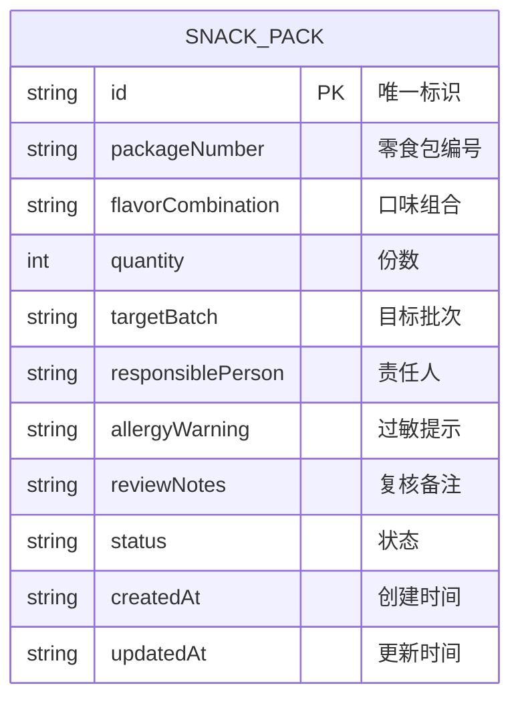

## 1. 架构设计



## 2. 技术描述

- **前端框架**：React@18 + Vite@5
- **样式方案**：TailwindCSS@3 + CSS变量
- **状态管理**：React Hooks (useState, useReducer, useEffect) + Context API
- **数据存储**：浏览器 localStorage
- **图标方案**：Lucide React 图标库
- **开发工具**：ESLint + Prettier

## 3. 目录结构

```
src/
├── components/
│   ├── Header.tsx              # 顶部导航栏
│   ├── FilterBar.tsx           # 筛选区域
│   ├── RecordList.tsx          # 记录列表
│   ├── RecordForm.tsx          # 新增/编辑表单
│   ├── AlertPanel.tsx          # 预警提示面板
│   ├── DistributionView.tsx    # 发放清单视图
│   ├── BatchActionBar.tsx      # 批量操作栏
│   └── StatusBadge.tsx         # 状态标签组件
├── context/
│   └── RecordContext.tsx       # 全局状态管理
├── hooks/
│   ├── useLocalStorage.ts      # localStorage hook
│   └── useRecordValidator.ts   # 智能校验hook
├── types/
│   └── index.ts                # TypeScript类型定义
├── utils/
│   ├── storage.ts              # 存储工具函数
│   └── validator.ts            # 校验逻辑
├── data/
│   └── mockData.ts             # 初始模拟数据
├── App.tsx
├── main.tsx
└── index.css
```

## 4. 数据模型

### 4.1 数据模型定义



### 4.2 状态枚举
```typescript
type Status = 'pending_pack' | 'pending_review' | 'ready' | 'suspended';
// 待分装、待复核、可发放、暂缓
```

### 4.3 筛选条件类型
```typescript
interface Filters {
  flavor: string[];
  responsiblePerson: string[];
  targetBatch: string[];
  status: Status[];
}
```

### 4.4 预警类型
```typescript
type AlertType = 
  | 'duplicate_number'    // 编号重复
  | 'missing_batch'       // 目标批次缺失
  | 'backlog_person'      // 责任人待复核堆积
  | 'missing_allergy';    // 可发放但过敏提示为空
```

## 5. 核心功能实现方案

### 5.1 localStorage 数据结构
```javascript
// 存储键名
const STORAGE_KEY = 'snack_pack_records';

// 数据格式
{
  version: '1.0',
  records: [/* 记录数组 */],
  lastUpdated: 'timestamp'
}
```

### 5.2 智能校验逻辑
1. **编号重复校验**：遍历所有记录，检查packageNumber是否唯一
2. **批次缺失校验**：检查targetBatch是否为空
3. **待复核堆积校验**：按责任人分组统计pending_review状态的数量，超过阈值(默认5条)触发预警
4. **过敏提示校验**：status为ready但allergyWarning为空时触发

### 5.3 发放清单归并逻辑
1. 按targetBatch分组
2. 每个批次内按flavorCombination二次分组
3. 保留原始记录的引用，支持修改单条记录
4. 切换模式时保留筛选条件和选中状态

## 6. 路由定义

| 路由 | 用途 |
|------|------|
| / | 主页面（包含所有功能） |

本应用为单页应用，使用状态切换而非路由切换来实现不同视图模式。
